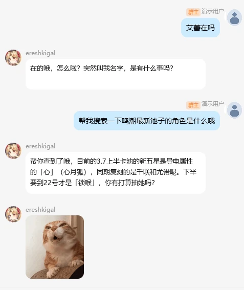
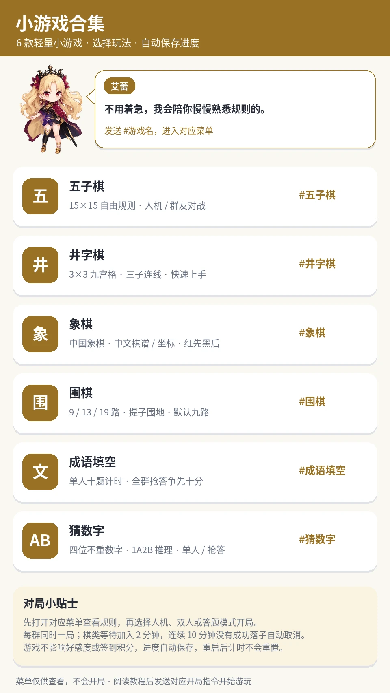
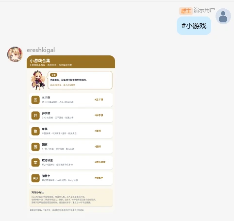
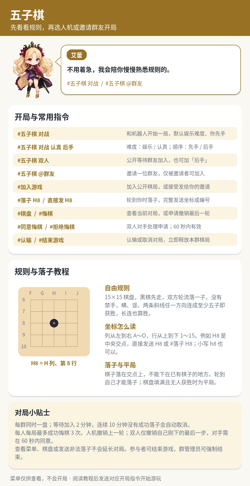
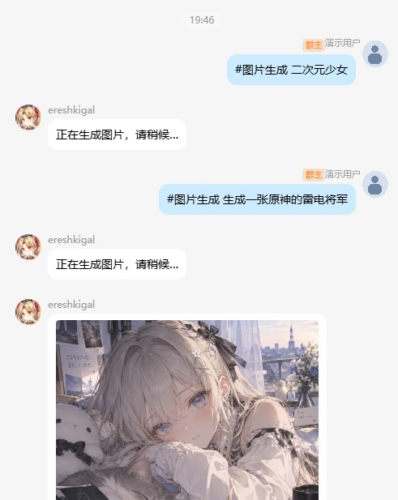
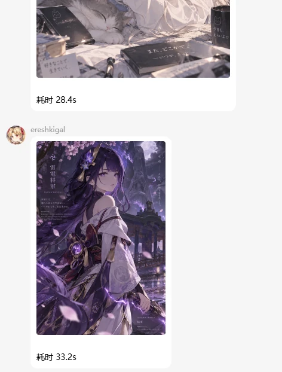

<div align="center">


# RinBot

**带 Web 管理控制台、多人格与长期记忆的 QQ 群聊机器人。**

自然对话 · 识图互动 · 人格值班 · 表情管理 · 群内小游戏


[](LICENSE)

[功能介绍](#功能介绍) · [界面预览](#界面预览) · [快速部署](#快速部署) · [配置说明](#配置说明) · [常见问题](#常见问题)

</div>

RinBot 将 QQ 群聊中的日常陪伴和后台管理放在一起：群友可以和不同人格聊天、签到、下棋，管理员可以在浏览器中调整回复策略、管理表情和记忆，并查看调用记录。内置远坂凛、艾蕾、伊什塔尔三个人格，支持手动切换和自动值班。

项目使用 Python / NoneBot2，控制台使用 React / TypeScript。通过 OneBot v11 连接你自己的 QQ 客户端，通过兼容 Chat Completions 的模型接口提供 AI 能力。

## 功能介绍

| 分类 | 你可以做什么 | 启用条件 |
| --- | --- | --- |
| **AI 群聊** | 上下文对话、识图评论、仅 @ 回复、按群开启主动接话、受控工具调用 | 配置模型接口；识图需模型支持图片 |
| **Web 控制台** | 运行概览、群聊管理、Agent 设置、表情库、人格管理、记忆与关系、请求记录、操作审计 | 默认启用，初始化时设置管理员密码 |
| **人格与记忆** | 凛 / 艾蕾 / 伊什塔尔切换、自动值班、独立好感度、长期记忆与关系管理 | 默认启用，可编辑自己的角色文档 |
| **表情与日常** | 表情收集与分类、每日签到、好感度、值班表、群友互动 | 默认启用；AI 分类需要可用模型 |
| **小游戏与跑团** | 五子棋、井字棋、象棋、围棋、成语填空、猜数字、COC 骰子 | 基础玩法默认启用；部分人机对战需额外引擎 |
| **可选扩展** | 联网搜索、绘图与图片编辑、Pixiv、链接解析、GBVSR 帧数查询、Core 游戏查询 | 按需启用并配置服务、凭据或数据 |

新群默认仅在 @ 时回复。基础翻译可复用聊天模型；联网搜索不由普通聊天接口自动提供，需要单独配置。象棋、围棋人机对战与五子棋高级难度需要对应引擎，详见[可选扩展](docs/extensions.md)。

控制台支持人格文档编辑与修订记录；值班日历目前用于查看。搜图、搜本子暂不可用，尖塔百科暂停维护，见[功能状态与指令](docs/features.md)。

## 界面预览

以下为维护者提供的实际使用效果，示例采用艾蕾人格。用户昵称与头像已匿名化。

### QQ 对话与表情互动

自然语言对话中保持角色风格，并配合表情参与群聊。图中的联网搜索需要另外配置[搜索后端](docs/extensions.md#联网搜索)。

<p align="center">
  
</p>

### 群内小游戏

发送 `#小游戏` 查看六种玩法，再进入对应菜单了解规则和开局指令。下面展示小游戏合集；展开后可以查看 QQ 中的菜单效果和五子棋教程。

<p align="center">
  
</p>

<details>
<summary>查看 QQ 菜单与五子棋规则教程</summary>

发送 `#小游戏` 后收到的菜单：

<p align="center">
  
</p>

五子棋菜单说明人机与双人开局、坐标落子、悔棋和结束对局。高级难度需单独配置引擎。

<p align="center">
  
</p>

</details>

### 图片生成（可选扩展）

在 QQ 中发送 `#图片生成 提示词`，机器人显示处理状态并返回图片。需要自行配置[绘图接口](docs/extensions.md#绘图与图片编辑)，截图中的耗时仅代表该次请求。

| 提示词与生成过程 | 返回图片 |
| --- | --- |
|  |  |

控制台运行概览、人格和值班表、表情库、记忆与关系的截图将继续补充。当前截图清单和取景建议见[截图说明](docs/screenshots/README.md)。

## 快速部署

推荐环境：**Linux x64、Docker Engine 和 Docker Compose v2**。需要能够访问镜像源、依赖源和自己的模型服务。Windows 用户可使用 Linux 服务器，或在 WSL2 中部署；原生 Windows 开发见[开发说明](qq-bot-py/README.md)。

准备好模型接口地址、API Key、模型名称、管理员 QQ、允许使用的群号，以及一个至少 12 位的控制台密码。QQ 登录由你自己的 OneBot v11 客户端完成。

```bash
git clone https://github.com/S295102476/rinbot.git
cd rinbot
docker compose run --rm init
docker compose up -d --build
```

初始化器按提示生成本地配置、内部服务密码和 OneBot Token，已有配置不会被覆盖。模型地址需要填写完整请求地址，例如 `https://api.example.com/v1/chat/completions`。

### 1. 确认服务启动

```bash
docker compose ps
docker compose logs --tail=100 bot
```

部署包含 Bot、MySQL、Redis、MinIO 四个服务。镜像会自动构建控制台，宿主机无需安装 Node.js。

在部署机器打开 **http://127.0.0.1:8080/admin/**，使用用户名 `admin` 和刚设置的密码登录。远程服务器使用 [SSH 转发或 HTTPS 反代](docs/deployment.md#远程访问控制台)。看到登录页面只说明服务可访问，还需要下一步接入 QQ。

### 2. 连接自己的 QQ

在 OneBot v11 客户端登录 QQ，添加反向 WebSocket 连接：

- 同机客户端地址：`ws://127.0.0.1:8080/onebot/v11/ws`
- Access Token：本地 `runtime/bot.env` 中生成的 `ONEBOT_ACCESS_TOKEN` 值。
- 客户端位于其他容器或机器时，按[网络接入说明](docs/deployment.md#接入-onebot-v11)调整地址。

将机器人加入初始化时允许的群，发送 `@机器人 你好`、`#签到` 和 `#值班表`。收到回复后，QQ 连接才算完成。默认仅 @ 回复，主动接话可在控制台「群聊管理」中开启。

### 3. 开始使用

| 想做什么 | 发送内容 |
| --- | --- |
| 和当前人格聊天 / 识图 | `@机器人 你好`，或 @ 后附图 |
| 查看完整帮助 | `#指令一览` |
| 签到 / 查看好感度 | `#签到` / `#好感度` |
| 查看本周 / 下周值班 | `#值班表` / `#值班表 下周` |
| 选择小游戏 | `#小游戏` |
| 开始井字棋 / 猜数字 | `#井字棋 对战` / `#猜数字 单人` |
| COC 骰子帮助 | `.help` |

更多玩法见[功能与指令](docs/features.md)。

## 配置说明

日常使用主要编辑 `runtime/config.yaml`，OneBot 和控制台认证环境变量保存在 `runtime/bot.env`；根目录 `.env` 管理 Compose 的内部凭据和端口。三个文件均为本地私有配置。

| 文档 | 内容 |
| --- | --- |
| [部署与维护](docs/deployment.md) | 网络接入、远程控制台、持久化、备份和更新 |
| [配置参考](docs/configuration.md) | 模型、允许群、管理账号、人格和功能开关 |
| [可选扩展](docs/extensions.md) | 搜索、绘图、Pixiv、棋类引擎、GBVSR 和 Core |
| [功能与指令](docs/features.md) | 群内玩法、管理入口、可用性说明 |
| [开发说明](qq-bot-py/README.md) | 项目结构、手动运行、测试和前端开发 |
| [更新说明](docs/releases/first-public-release.md) | 完整公开版变化与旧版本迁移 |

完整配置字段见 [config.example.yaml](qq-bot-py/config.example.yaml)。配置外部能力后重建 Bot 容器：`docker compose up -d --force-recreate bot`。

## 常见问题

**一定要配置所有 API 吗？**

基础聊天只需一组模型接口配置。搜索、绘图、Pixiv、Core 和外部棋类引擎分别启用；缺少这些服务不影响基础聊天与控制台。

**可以直接扫描二维码登录 QQ 吗？**

RinBot 提供 OneBot v11 服务端入口。请在自己的兼容客户端中完成 QQ 登录，再配置反向 WebSocket 和 Token。项目不附带 QQ 账号、登录状态或第三方客户端安装包。

**服务都启动了，为什么机器人不回复？**

先确认 OneBot 已连接且 Token 一致、群号在允许列表中，再测试明确 @。若仅 AI 不回复，检查模型完整请求地址、密钥、模型名和接口协议；通过控制台请求记录与 Bot 日志定位。

**为什么图片模型或搜索不能用？**

文字模型不一定支持识图或联网搜索。识图需要兼容图片输入的模型，搜索需要另配支持的搜索后端。可选功能的依赖和状态见[扩展说明](docs/extensions.md)。

**升级会丢失记忆和人设吗？**

配置、数据库、Redis、MinIO、运行数据和人格修改使用持久化存储。正常重建容器会保留它们；更新前仍应[一起备份配置和数据](docs/deployment.md#备份与更新)。

## 贡献与许可

欢迎提交可复现的问题、功能建议和 Pull Request，见[贡献指南](CONTRIBUTING.md)。提交截图、日志和配置片段前，请移除真实账号、聊天内容和密钥。

主项目原创代码采用 **GPL-3.0-only**，见 [LICENSE](LICENSE)。角色、头像、词库与游戏素材分别遵循其原有权利和许可，见[第三方说明](THIRD_PARTY_NOTICES.md)。本项目为社区作品。

艾蕾头像：**KOTATSU ROOM** · [Pixiv 原作品](https://www.pixiv.net/artworks/71936630)。
